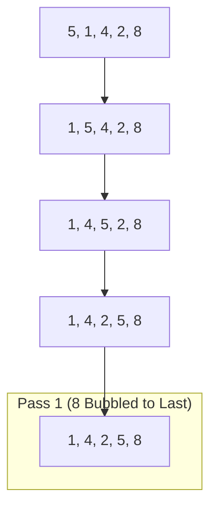

# 🫧 Bubble Sort Algorithm

Bubble Sort is one of the simplest sorting algorithms. It works by repeatedly swapping adjacent elements if they are in the wrong order. The algorithm "bubbles" the largest (or smallest, depending on the sorting order) element to its correct position in each pass.

---

## 🛠️ How it works

1. **Compare** the first and second elements.
2. If the first element is **greater** than the second, **swap** them.
3. Move to the next pair and repeat until the end of the array.
4. After the first pass, the largest element is at the end.
5. **Repeat** the process for the remaining elements until the entire list is sorted.

---

## 📊 Visual Representation



---

## 💻 Python Implementation

Here is a clean implementation of the Bubble Sort algorithm in Python:

```python
def bubble_sort(arr):
    n = len(arr)
    # Traverse through all array elements
    for i in range(n):
        # Last i elements are already in place
        swapped = False
        for j in range(0, n - i - 1):
            # Traverse the array from 0 to n-i-1
            # Swap if the element found is greater than the next
            if arr[j] > arr[j + 1]:
                arr[j], arr[j + 1] = arr[j + 1], arr[j]
                swapped = True
        
        # If no two elements were swapped by inner loop, then break
        if not swapped:
            break
    return arr

# Example Usage
data = [64, 34, 25, 12, 22, 11, 90]
sorted_data = bubble_sort(data)
print(f"Sorted array: {sorted_data}")
```

---

## ⏱️ Complexity Analysis

> [!IMPORTANT]
> Bubble Sort is generally considered inefficient for large datasets compared to algorithms like QuickSort or MergeSort.

| Complexity Category | Best Case | Average Case | Worst Case |
| :--- | :--- | :--- | :--- |
| **Time Complexity** | $O(n)$ (Optimized) | $O(n^2)$ | $O(n^2)$ |
| **Space Complexity** | $O(1)$ | $O(1)$ | $O(1)$ |

### Why use Bubble Sort?
- **Simplicity**: Extremely easy to understand and implement.
- **Space Efficiency**: It's an in-place sorting algorithm (requires $O(1)$ extra memory).
- **Stability**: Elements with equal values maintain their relative order.

---

> [!TIP]
> Use an `swapped` flag to optimize the algorithm. If no swaps occur during a pass, the array is already sorted and we can exit early!
